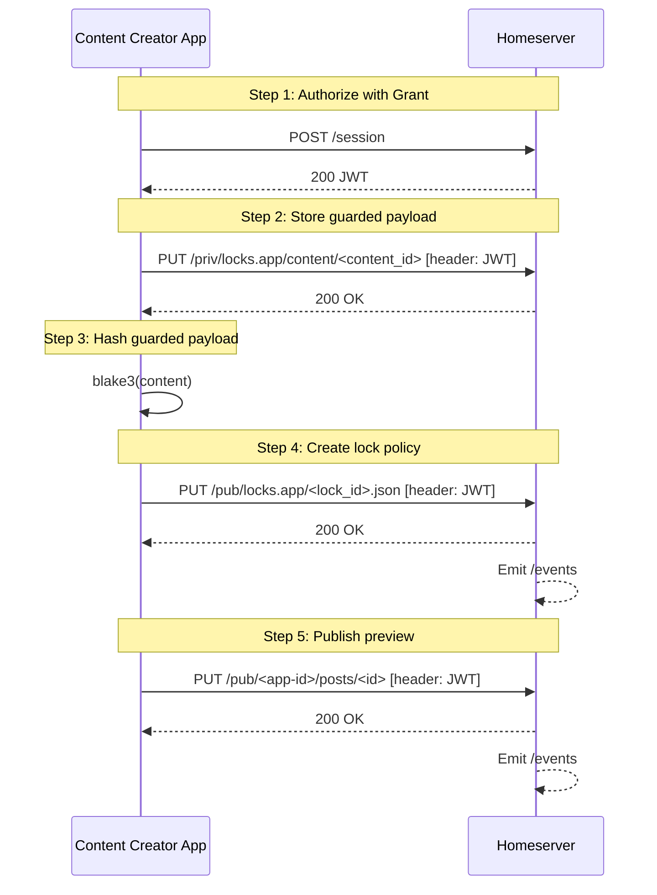
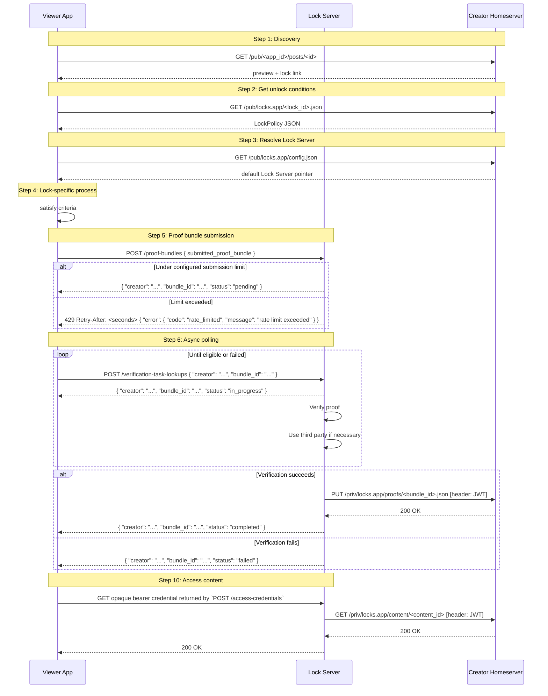

# Pubky Locks

Pubky Locks is a pre-production content-gating application for the Pubky ecosystem.
Creators publish lock policies for guarded homeserver resources; viewers satisfy the
criteria and receive scoped access through a Lock Server.

> **Warning:** Interfaces, persistence formats, and deployment assumptions may change
> without migration support. Do not use this repository to protect valuable private
> content or real funds without an independent security and operational review.

## Repository layout

- `locks-core` — protocol and domain types
- `locks-service` — application workflows and persistence adapters
- `locks-server` — HTTP server, worker, configuration, and runtime composition
- `locks-sdk` — native creator/viewer SDK
- `locks-sdk/bindings/js` — browser JS/WASM bindings
- `locks-e2e` — integration and PostgreSQL-backed tests
- `examples/js-sdk` — local creator and reader browser demos

## Build and verify

The repository uses Rust 1.89.0. CI also requires PostgreSQL 16, Node.js 22,
`cargo-nextest`, the `wasm32-unknown-unknown` target, and `wasm-pack` 0.13.1.

```bash
cargo fmt --check
cargo clippy --workspace --all-targets --all-features -- -D warnings
cargo test --workspace --no-run
npm --prefix locks-sdk/bindings/js run test
```

See [`CONTRIBUTING.md`](CONTRIBUTING.md) for the exact test taxonomy and
[`.github/workflows/check.yml`](.github/workflows/check.yml) for PostgreSQL/E2E gates.

## Local browser demo

The integrated Docker Compose flow starts PostgreSQL, a local Pubky testnet, the Lock
Server, and separate creator/reader browser demos. Follow the copy-pasteable setup in
[`examples/js-sdk/README.md`](examples/js-sdk/README.md).

From a fresh clone:

```bash
docker compose up --build
```

The Compose entrypoint generates and persists a random runtime master
key in the private `lock-home` volume. Set
`PUBKY_LOCK_RUNTIME_MASTER_KEY` before startup only when you need to supply
your own 32-byte unpadded-base64url key. A supplied override is atomically
persisted to that volume, so a later startup without the environment variable
continues using the same key rather than silently reverting to an older key.

Verified browser-facing defaults are:

- Lock Server: <http://127.0.0.1:3000>
- creator demo: <http://127.0.0.1:8080/examples/js-sdk/>
- reader demo: <http://127.0.0.1:8081/reader/>

For the opt-in payment-lock demonstration, including Paykit Server, Bitcoin regtest,
and Fulcrum, use the separate Compose definition:

```bash
docker compose -f compose.paykit-local-demo.yaml up --build
```

Its external build contexts use anonymously reachable public repositories pinned to
immutable commits; no sibling Paykit or Pubky checkout is required. The full demo adds
Paykit Server at <http://127.0.0.1:3001> and publishes the reader at
<http://127.0.0.1:8088/reader/>. Pubky Testnet is built from `pubky/pubky-core` source at
commit `75eb1324f86e8caa16c41f18a2cd6b8e1909ee7b`, not from a released Pubky image or
version. Payment remains a manual operator action.

## Documentation

- [Lock Server API](docs/API.md)
- [Lock Server Runtime](docs/RUNTIME.md)
- [Browser SDK](docs/SDK.md)
- [Domain model](docs/DOMAIN_MODEL.md)
- [Terminology](docs/THESAURUS.md)
- [Local operator demo](docs/LOCAL_OPERATOR_DEMO.md)
- [Security policy](SECURITY.md)
- [Support](SUPPORT.md)

## Design proposal

The remainder of this document records the original draft proposal and its security
trade-offs. Current route and runtime documentation above is authoritative where the
proposal differs from the implementation.

**Proposal version**: 0.5
**Proposal date**: May 7, 2026
**Status**: Draft

## 1. Intro

### 1.1. What are Locks

Locks is the content gating application for the Pubky ecosystem. Content creators attach criteria like payment, password, follower status, time window, limited seats, or other future lock types to their content. Viewers receive access to the guarded content by satisfying those criteria.

In this proposal, Locks is intentionally an application-layer mechanism. It does not require homeservers to understand payment logic, subscriptions, passwords, or any other lock-specific verification. Homeservers continue to enforce Pubky sessions and path-scoped capabilities; the Lock Server adds conditional access logic on top.

### 1.2. What this proposal is not

This proposal does not define how every lock type is verified. Each lock type can be added separately, and its verification will depend on the nature of that lock.

This proposal also does not specify the exact secure communication method between Viewer App and Lock Server. The security of that communication is out of scope because it can be handled with existing secure client-server communication methods.

The paths, payloads, and endpoint shapes in this document are suggestions and examples. They may change as the implementation and capability model evolve.

### 1.3. Goals

Design of this proposal was created with the following goals:

- Enable lock functionality with minimum disturbance of existing Pubky stack elements
- Keep implementation simple, with clear trade-offs and known paths for mitigation
- Deliver Locks into the Pubky ecosystem without changing existing trust assumptions
- Keep Locks compatible with Pubky's credible-exit narrative
- Support viewers who may or may not have Pubky identities

### 1.4. Use cases to consider

- Individual items behind a paywall
- All items behind a subscription
- A password-protected item
- An item available for a limited time, relative or absolute
- An item available to a limited number of users, for example first 10 users can access
- An item available only to followers

---

## 2. Proposal

### 2.1. Terminology

**Locks Server** is a Pubky ecosystem application from the perspective of permissions and authentication. It receives creator-granted capabilities and uses a homeserver-issued session/JWT to read and, where needed, write under creator-owned paths. From the traditional web point of view, it is a server which may or may not have a user interface. A user interface is desired for human-readable representation of lock file content.

For the implemented authorization boundary, see
[ADR 0017](docs/ADRs/0017-creator-granted-auth-boundary.md).

**Content creator** is a Pubky user who creates content they want to put behind a lock.

**Content viewer** is a user or non-user who is able to provide satisfactory proof for a lock's criteria. A viewer does not necessarily have a Pubky identity. Some lock types may require viewer identity; others may support anonymous viewers.

**Content lock** is structured public data that specifies the criteria for accessing guarded content.

**Submitted proof bundle** is structured data sent by a viewer to the Lock Server. It contains information required to verify that the viewer satisfies the lock criteria.

**Verified proof bundle** is a submitted proof bundle after successful verification. It is stored by the Lock Server under the creator's guarded Locks storage. A stored verified proof bundle functions as an entitlement record.

**Bundle ID** is a cryptographically random identifier used as the final filename for the stored verified proof bundle. It is a bearer secret. The viewer is responsible for storing it for future reference, for example after Lock Server migration.

**Access credential** is the still-to-be-finalized token, URL, session, or other credential issued by the Lock Server after successful verification or after resolving an existing verified proof bundle.

### 2.2. Lock Server

Lock Server as a Pubky application can optionally provide functionality for content creator to:

- Create guarded content on the creator's homeserver
- Create public lock policies under `/pub/locks.app/*`
- Store verified proof bundles under a guarded Locks path

Alternatively, content creators can create guarded content and public lock policies using other available methods.

Lock Server as a Pubky application provides functionality for content viewer to:

- Read public lock conditions
- Accept and verify viewer proof bundles
- Store verified proof bundles as entitlement records after successful verification
- Issue an access credential
- Proxy-read guarded content from `pubky<creator_z32>/priv/<content_id>` and proxy-pass the response to the viewer
- Optionally provide UI for representation of public lock conditions

### 2.3. Capabilities

The Lock Server requires creator-granted capabilities according to the role it performs.

Minimum for verification plus proxy access:

- Read the guarded content selected by Locks
- Write verified proof bundles under a Locks-controlled guarded path

A future narrower target could look like:

```text
[/priv/locks.app/content/:r, /priv/locks.app/proofs/:rw]
```

If the Lock Server also creates guarded content and public lock policies for the creator, it additionally needs write access to the guarded content namespace and:

```text
[/pub/locks.app/:rw]
```

Until narrower guarded capabilities are implemented, the interim grant may need to be broader, for example:

```text
[/priv/:rw, /pub/locks.app/:rw]
```

This trade-off should be explicit: a broad `/priv/:rw` grant means the creator is trusting the Lock Server with all guarded payloads, not only Locks-specific payloads. The desired end state is a Locks-specific private namespace.

### 2.4. Lock Server addressing

The Lock Server is addressed as a Pubky resource, which also makes it resolvable as an HTTPS service through Pubky/Pkarr resolution.

Canonical Pubky resource form, example:

```text
pubky<lock_server_z32>/<creator_z32>/unlock/<lock_id>
```

Resolved HTTPS transport form, example:

```text
https://_pubky.<lock_server_z32>/<creator_z32>/unlock/<lock_id>
```

The exact transport spelling should follow the current Pubky resource-addressing conventions. The important distinction is that the lock policy should treat the Lock Server as a Pubky-addressed service first, with HTTPS as the resolved transport.

The Lock Server has its own Pkarr record, like other Pubky-addressed services.

Example, subject to final Pubky/Pkarr conventions:

```text
@    A        <IP>
@    HTTPS    <domain name>
```

### 2.5. Service discovery and migration pointer

For credible exit, the default Lock Server pointer should be centralized rather than duplicated into every lock policy.

Recommended default location:

```text
/pub/locks.app/config.json
```

Current v0 Lock Service Pointer shape:

```json
{
  "version": 1,
  "default_lock_server": "pubky<lock_server_z32>",
  "created_at": "2026-05-07T00:00:00Z"
}
```

The current local skeleton authors this object through dev/test-gated `POST /creator/lock-service-config`; it stores local in-memory state only and does not perform a Pubky homeserver write. A content lock may optionally override the default service when needed:

```json
{
  "lock_server": { "override": "pubky<other_lock_server_z32>" }
}
```

Per-lock service URLs are useful as an escape hatch, but should not be the default migration mechanism because they make service migration `O(<number of locks>)`.

A more risky alternative is to store the Locks service pointer in the user's Pkarr record, for example:

```text
_pubky    HTTPS    <homeserver public key>
_locks    HTTPS    <lock server public key>
```

This needs more careful consideration and should not be the default in this draft.

---

## 3. Flow and diagrams

### 3.1. Content creation

#### Flow 3.1

1. Content creator authorizes the Lock Server or creator app with the required capabilities.
2. Content creator uploads guarded content to their homeserver, preferably under a Locks-specific private namespace once supported.
3. Content creator computes a hash of the guarded content.
4. Content creator defines lock conditions and uploads the public lock policy to `/pub/locks.app/<lock_id>.json`.
5. Content creator creates a preview post anywhere, such as a pubky.app post, pointing to the public lock policy.

Example preview text:

```text
Check out my locked content at pubky<creator_z32>/pub/locks.app/<lock_id>.json
```

Guarded content write should not trigger a public `/events` entry. Public lock policy write should trigger `/events`.

Current implementation note: authenticated Pubky-backed creator publishing routes are implemented for `PUT /creator/priv-resources/content/<path>`, `DELETE /creator/priv-resources/content/<path>`, `POST /creator/content-locks`, and `POST /creator/lock-service-config`. They derive creator identity from a Locks-local frontend session and use Pubky homeserver repositories in production/dev integration composition; local-memory repositories remain test-support only. See [`docs/API.md`](docs/API.md) for the current HTTP route contract, [`docs/LOCAL_DEMO.md`](docs/LOCAL_DEMO.md) for the client-backed local flow, [`docs/RUNTIME.md`](docs/RUNTIME.md) for runtime/operator behavior, and [`docs/LOCAL_OPERATOR_DEMO.md`](docs/LOCAL_OPERATOR_DEMO.md) for a manual local HTTP walkthrough.

#### Diagram 3.1, simplified



### 3.2. Content retrieval

#### Flow 3.2

1. Viewer discovers lock either through a preview post or via `/events` endpoint. Event discovery may be missing human context.
2. Viewer reads public unlock conditions from `pubky<creator_z32>/pub/locks.app/<lock_id>.json`.
3. Viewer resolves the Lock Server using `/pub/locks.app/config.json`, unless the lock policy contains a service override.
4. Viewer solves the lock-specific challenge or gathers required proof material.
5. Viewer submits a proof bundle to the Lock Server. The current HTTP server applies a configurable process-local fixed-window admission limit before creating verification work.
6. Lock Server verifies the submitted proof bundle.
7. If verification fails, no entitlement is stored.
8. If verification succeeds, Lock Server stores the verified proof bundle under the creator's guarded Locks proof path using `bundle_id` as the final filename.
9. Lock Server returns an access credential or access URL to the viewer.
10. Viewer requests guarded content from the Lock Server using the access credential.
11. Lock Server proxy-gets the guarded content from the creator homeserver using its own creator-authorized JWT.
12. Lock Server proxy-passes the response to the viewer.

#### Diagram 3.2



### 3.3. Lock service migration, credible exit

1. Creator revokes the old Lock Server session/grant.
2. Creator grants the new Lock Server access to guarded content and stored verified proof bundles.
3. Creator updates `/pub/locks.app/config.json` with the new Lock Server pointer.
4. If a lock policy used a per-lock service override, that lock policy also needs to be updated.
5. Viewer presents their stored `bundle_id` to the new Lock Server.
6. New Lock Server reads the verified proof bundle from the creator's guarded Locks proof path.
7. New Lock Server decides whether to issue a new access credential.

Because verified proof bundles are stored on the creator's homeserver, migration does not require trusting or querying the old Lock Server's private database.

---

## 4. Payload examples

### 4.1. Lock policy

Public path:

```text
pubky<creator_z32>/pub/locks.app/<lock_id>.json
```

Example:

```json
{
  "version": 1,
  "creator": "pubky<creator_z32>",
  "primary_resource": {
    "path": "/priv/locks.app/content/post.json",
    "hash": "<blake3 guarded resource hash>",
    "content_type": "application/json",
    "size": 1234
  },
  "secondary_resources": {
    "/priv/locks.app/content/attachments/image.png": {
      "hash": "<blake3 attachment hash>",
      "content_type": "image/png",
      "size": 4567
    }
  },
  "criteria": [
    {
      "criterion_id": "crit_1",
      "verifier_type": "paykit-payment",
      "params": {
        "recipient_pubky": "pubky<creator_z32>",
        "amount": "50000",
        "asset": "BTC",
        "payment_in": 24
      }
    }
  ],
  "lock_logic": {
    "type": "all",
    "criteria": ["crit_1"]
  },
  "access_policy": {
    "requested_credential_ttl_seconds": 3600
  },
  "lock_server": {
    "override": "pubky<lock_server_z32>"
  },
  "created_at": "2026-05-07T00:00:00Z",
  "updated_at": "2026-05-07T00:00:00Z"
}
```

`requested_credential_ttl_seconds` controls the requested lifetime of a Lock-Server-issued access credential. It does not necessarily define the lifetime of the underlying entitlement. Entitlement lifetime is lock-type-specific.

For example:

- A paid article may create a durable entitlement.
- A rental may create a time-limited entitlement.
- A subscription may require renewal or re-checking.
- A follower-only lock may require identity and relationship re-checking.
- A password lock may issue only a temporary access credential.

### 4.2. Submitted proof bundle

A submitted proof bundle is sent by the viewer before verification. It is not stored as an entitlement unless verification succeeds.

For `paykit-payment`, the content lock criterion params are exactly `recipient_pubky`, positive base-unit string `amount`, non-empty `asset`, and positive whole-hour JSON `u64` `payment_in`. `recipient_pubky` must equal the content-lock creator. In v1 it must be the lock's only criterion, referenced exactly once by the lock logic. The submitted proof carries no payment details in its proof payload; it uses top-level `reader_public_key` plus the canonical `pubky_lock_resource` so the Lock Server can create the Paykit invoice.

Example:

```json
{
  "version": 1,
  "bundle_id": "<cryptographically random bearer secret>",
  "pubky_lock_resource": "pubky<creator_z32>/pub/locks.app/<lock_id>.json",
  "reader_public_key": "pubky<reader_z32>",
  "proofs": [
    {
      "criterion_id": "crit_1",
      "verifier_type": "paykit-payment",
      "payload": {}
    }
  ]
}
```

The `bundle_id` must be cryptographically random and treated as a bearer secret. The viewer is responsible for storing it for future reference.

`paykit-payment` v1 submissions are single-proof only: do not mix payment and non-payment proofs in the same bundle. After rate limiting and current canonical lock/reader preflight, the Lock Server checks the permanent lifecycle identity `{ creator, bundle_id }`. An exact persisted replay returns the existing lifecycle, while changed submitted proof material conflicts; neither replay calls Paykit again. Only a new identity requires Paykit configuration and creates a signed invoice with `{ bundle_id, lock_resource, reader }`.

The worker checks payment through a signed canonical `{ creator, bundle_id }` request to `POST /transactions/status`. Valid `undetected`, `detected`, and `confirmed` responses are evaluated against amount matching and the configured confirmation threshold. Transport, timeout, HTTP (including `404` or authorization), and response-decoding failures all durably return the task to pending for retry; v1 has no terminal Paykit payment failure. Responses never include invoice data, payment status internals, raw proof material, or an internal task ID.

### 4.3. Verified proof bundle / entitlement record

A verified proof bundle is stored only after successful verification. It functions as an entitlement record.

Guarded path example:

```text
pubky<creator_z32>/priv/locks.app/proofs/<bundle_id>.json
```

Example:

```json
{
  "version": 1,
  "bundle_id": "<cryptographically random bearer secret>",
  "status": "verified",
  "creator": "pubky<creator_z32>",
  "pubky_lock_resource": "pubky<creator_z32>/pub/locks.app/<lock_id>.json",
  "lock_hash": "<blake3 of canonical content lock>",
  "resource_set": {
    "primary_path": "/priv/locks.app/content/post.json",
    "resource_hashes": [
      "<blake3 guarded resource hash>",
      "<blake3 attachment hash>"
    ]
  },
  "verified_at": "2026-05-07T00:00:00Z",
  "verified_by": "pubky<lock_server_z32>",
  "criteria_satisfied": ["crit_1"],
  "proofs": [
    {
      "criterion_id": "crit_1",
      "verifier_type": "paykit-payment"
    }
  ],
  "entitlement": {
    "type": "durable",
    "expires_at": null
  }
}
```

A replacement Lock Server can use this record to decide whether to issue a new access credential. Depending on lock type, it may accept the record as sufficient, re-check external proof, reject it if the policy or content changed, or renew it if the entitlement is still valid.

### 4.4. Access credential placeholder

The final access credential format is not defined in this draft.

The current placeholder is:

```text
opaque bearer credential returned by `POST /access-credentials`
```

The access credential is currently an opaque bearer secret, not a URL. It must be non-guessable. It should be short-lived unless the lock type explicitly allows durable access. It is issued by the Lock Server after successful verification or after resolving an existing verified proof bundle.

Because viewers may be anonymous, bearer-style access is allowed. This means access credentials may be shareable. That is an accepted trade-off for anonymous-compatible locks. Lock types that require stronger non-transferability may require viewer Pubky identity and bind the access credential to that identity.

---

## 5. Security and trust considerations

### 5.1. Lock Server as trusted proxy

The Lock Server can read guarded content that the creator authorized it to read. This is an explicit trust trade-off. Locks preserves existing Pubky homeserver trust assumptions, but it introduces an application-layer trusted proxy.

A future design could combine Locks with encrypted guarded payloads, where the Lock Server releases or unwraps a decryption key instead of seeing plaintext. That is out of scope for this draft.

### 5.2. Anonymous viewers and shareability

Since viewers may not have Pubky identities, anonymous-compatible locks use bearer-style secrets such as `bundle_id` and access credentials. These can be shared by the viewer. TTLs and lock-specific policy should limit damage where needed.

Identity-required locks can require a Pubky viewer identity and signed requests.

### 5.3. Bundle ID handling

`bundle_id` is sensitive. It should:

- be cryptographically random
- be treated as a bearer secret
- not appear in public lock policy data
- be stored by the viewer if future reference is desired
- be validated by the Lock Server before being used as a filename
- not allow path traversal or caller-controlled arbitrary paths

### 5.4. Content hash

Including a hash of the guarded content helps identify what exact payload the lock applied to. This is especially useful if guarded content or lock policy is later removed and overwritten.

A verified proof bundle should store both the lock policy hash and guarded content hash so a future Lock Server can distinguish old entitlements from current content.

### 5.5. Verification submission rate limiting

The current Lock Server HTTP implementation protects `POST /proof-bundles` with a configurable process-local fixed-window rate limit. The limit is keyed by client network address and content creator, not by Bundle ID, because viewers can generate unlimited Bundle IDs.

Default runtime config:

```toml
[rate_limits.verification_submission]
enabled = true
max_requests = 60
window_seconds = 60
```

When the limit is exceeded, the server returns `Retry-After` with the remaining fixed-window time in seconds:

```http
429 Too Many Requests
Retry-After: <seconds>
```

```json
{
  "error": {
    "code": "rate_limited",
    "message": "rate limit exceeded"
  }
}
```

This is an abuse guard only. It does not replace proof-bundle idempotency/conflict checks, entitlement lifetime, credential TTL, or lock-type-specific policy.

### 5.6. Runtime health and readiness

The current Lock Server HTTP implementation exposes small operator-facing health/readiness endpoints. These are runtime/process routes, not product/domain use cases.

`GET /healthz` reports liveness only once the HTTP router is serving:

```http
200 OK
```

```json
{
  "status": "ok"
}
```

`GET /readyz` reports whether the configured runtime dependencies are usable.

Ephemeral runtime currently means in-memory process composition:

```http
200 OK
```

```json
{
  "status": "ready",
  "runtime_storage": "ephemeral",
  "worker_enabled": true
}
```

Persisted runtime currently means Postgres-backed runtime. When the Postgres pool ping succeeds:

```http
200 OK
```

```json
{
  "status": "ready",
  "runtime_storage": "persisted",
  "worker_enabled": true
}
```

When the persisted runtime dependency is unavailable:

```http
503 Service Unavailable
```

```json
{
  "status": "not_ready",
  "runtime_storage": "persisted",
  "worker_enabled": true
}
```

Health/readiness responses are deliberately secret-free. They do not expose database URLs, secret paths, Lock Server identities, worker IDs, task IDs, proof material, access credentials, or rate-limit counters.

---

## 6. Open questions

1. What is the final access credential format?
   - signed URL
   - Lock-Server-issued JWT
   - cookie/session
   - another bearer token format
   - viewer-bound token when viewer has Pubky identity

2. What is the final narrow capability model for guarded Locks paths?
   - Current implementation may require broader guarded permissions.
   - Desired end state is a Locks-specific private namespace.

3. Should `bundle_id` be entirely viewer-generated, entirely server-generated, or jointly derived?
   - Viewer needs to store it.
   - Lock Server must prevent collisions and unsafe path usage.

4. What canonicalization is used for the content lock hash?
   - Current implementation uses BLAKE3 over canonical content-lock JSON; future Lock Servers need to preserve that invariant when verifying that an entitlement belongs to a particular policy version.

5. Should verified proof bundles store raw proof details, only verification results, or both?
   - Storing raw proof details helps migration.
   - It may increase privacy sensitivity.

6. How should each lock type define entitlement lifetime?
   - durable
   - temporary
   - renewable
   - re-check on access
   - one-shot

7. Should the Lock Server store any failed verification attempts?
   - Current proposal says no entitlement is stored unless verification succeeds.
   - Current implementation has a process-local fixed-window proof-submission rate limit; durable failed-attempt audit storage remains out of scope.
